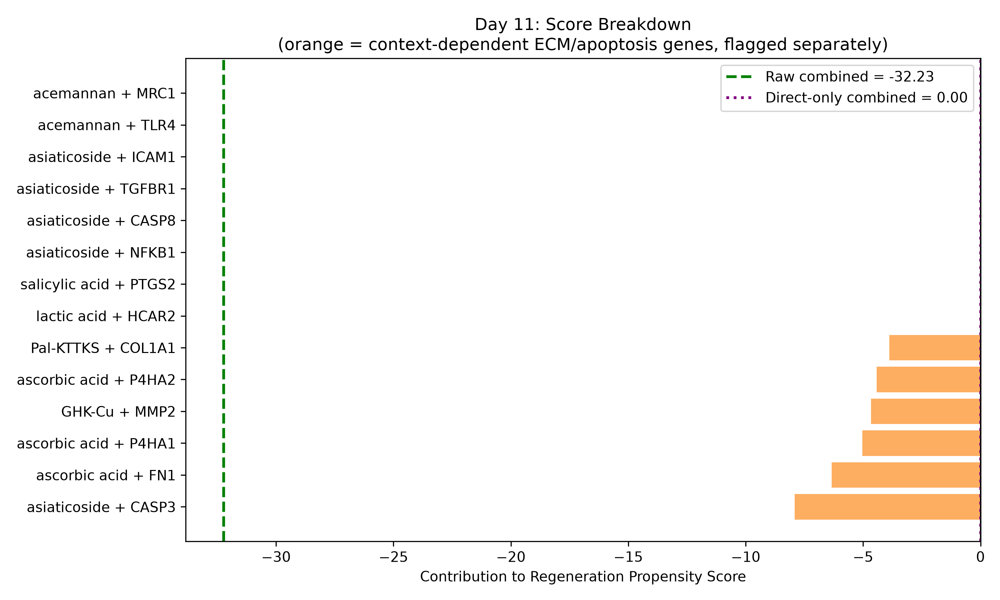

# Serum-Primed Healing: In Silico Regeneration Prediction

Computational pipeline predicting the regenerative potential of serum/patch ingredients by combining molecular docking, cross-species transcriptomic signatures, and a transparent evidence-weighted scoring system.

## Compounds screened

Lactic acid, salicylic acid, ascorbic acid, asiaticoside, acemannan, Pal-KTTKS, GHK-Cu, glycolic acid.

## Pipeline

1. **Target identification**: PubChem (CID/SMILES/SDF) + SwissTargetPrediction, cross-checked against literature mechanisms.
2. **Molecular docking**: AutoDock Vina (local CLI), blind-box docking auto-computed from receptor geometry. 11/13 compound-target pairs successfully docked; 2 (acemannan pairs) excluded because the molecule size exceeds standard docking tool limits.
3. **Cross-species signature comparison**: DESeq2 on:
   - Mouse skin regenerative vs. scarring (reused from `regen-convergence-v2`, GSE186527; descriptive-only due to low replicate pooling)
   - Human keloid vs. normal (GSE158395; lesional keloid n=4 vs. normal donor skin n=6)
4. **Regeneration Propensity Score** *(in progress)*: evidence-weighted, with a fully transparent per-pair contribution table.

## Key results so far

- 11 docking runs completed (AutoDock Vina); scores range from -3.59 to -13.68 kcal/mol.
- Human signature: P4HA1, P4HA2, CASP3, COL1A1 and MMP2 significantly upregulated in keloid (scarring) vs. normal (padj < 0.05).
- Mouse signature: no targets reached significance (padj = 1 across the board), consistent with the dataset's known low-replicate limitation.
- No mouse-human agreement is currently computable because the mouse side is underpowered; this is stated explicitly as a limitation rather than omitted.

## Regeneration Propensity Score Breakdown



## Repository Structure

```text
serum-primed-healing/
├── data/
│   ├── raw/                     # compound SDFs, receptor PDBs
│   ├── processed/               # pdbqt conversions, compound/target tracking tables
│   └── from_regen_convergence/  # reused mouse DE data
├── results/
│   ├── docking/                 # docking score tables
│   ├── de_tables/               # DESeq2 outputs (mouse, human, cross-reference)
│   ├── figures/                 # all generated PNG/SVG figures
│   └── poses/                   # Vina docking pose files
├── scripts/                     # all analysis scripts (Python + R)
├── convert_ligands.py
├── prep_receptors.py
├── find_pocket_centers.py
└── run_vina_docking.py
```

## Reproducing

- Python env: `conda create -n serum-healing python=3.11`, then `pip install pandas requests biopython matplotlib`. Install Open Babel and AutoDock Vina via conda-forge.
- R: DESeq2 and GEOquery via BiocManager.
- Run the scripts in `scripts/` in day-numbered order (`day1_pubchem.py` ... `day8_cross_reference.R`).

## Limitations

- Docking scores are computational predictions, not measured binding affinities.
- The mouse regenerative signature is descriptive-only (GSE186527: pooled libraries, no per-replicate statistics).
- GHK-Cu was docked as the peptide backbone only; Cu2+ coordination chemistry is not captured by standard scoring functions.
- Acemannan was not docked (molecule size exceeded tool limits); its contribution to the final score is literature-only.
- This pipeline produces a hypothesis-generating, evidence-weighted prediction, not a validated biological outcome. Wet-lab or in vivo testing is required to confirm any result.
